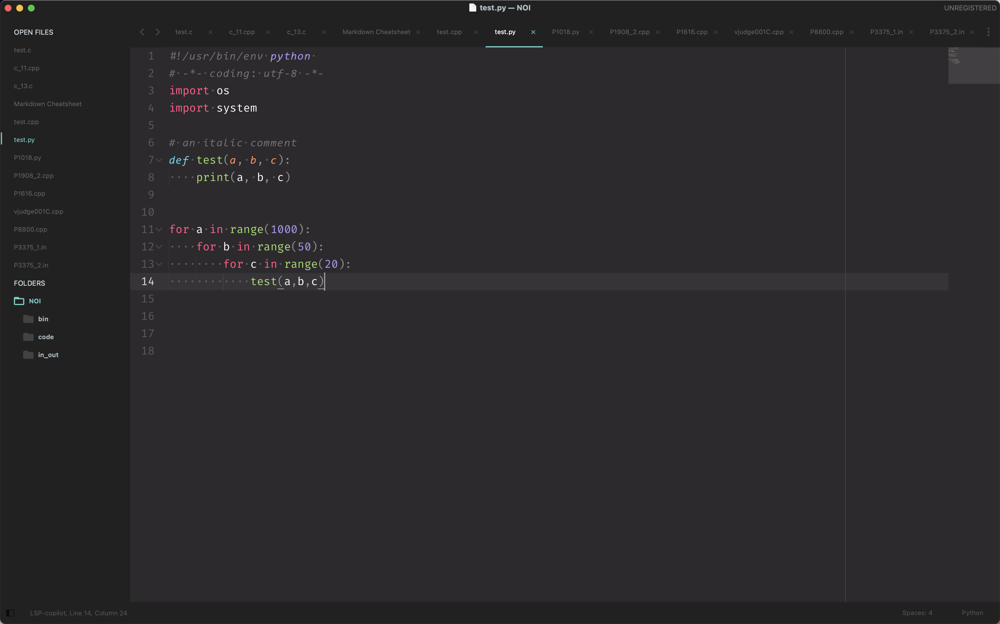
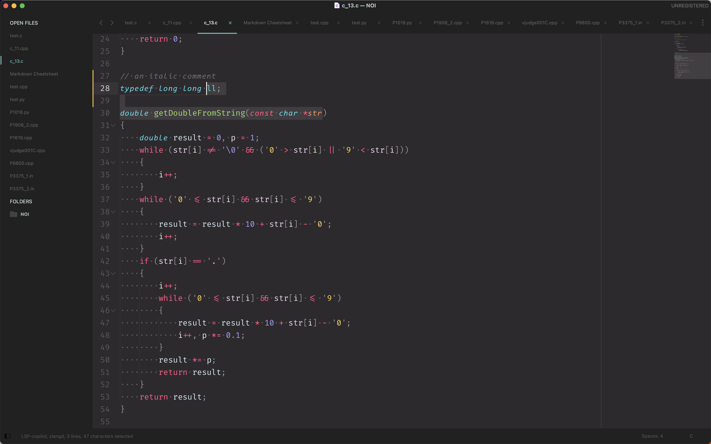

# Hybrid fonts for sublime text 4

In VScode, users can use two fonts by installing custom css plugin and changing css styles.

But there is no way changing css in sublime text 4. But sublime can detect bold and italic fonts in a font family. For example, Fira Code is a font family, which contains Bold,Light,Medium,SemiBold,Regular,Retina fonts.

`"font_face": "Fira Code",` in Preferences.sublime-settings tells sublime to use the fira code font family. My sublime can only distinguish FiraCode-Italic and FiraCode-Bold.

When FiraCode-Italic doesn't exisit, sublime will fake the italic font. However, it fails to fake the bold font if FiraCode-Bold is not found. In this case, a text dosn't change when it sopposed to be bold.

## Fira-Code-60002

This folder contains 7 ttf fonts:

```
FiraCode-Bold.ttf     FiraCode-Medium.ttf   FiraCode-SemiBold.ttf
FiraCode-Italic.ttf   FiraCode-Regular.ttf
FiraCode-Light.ttf    FiraCode-Retina.ttf
```

Up till 2023/1/9, the latest Fira Code version is 6.2, but obviously, FiraCode 6.2 doesn't provide an italic font. So I combined Fira Code with [consolas_ligaturized](https://github.com/somq/consolas-ligaturized).

To be more specefic, I extracted italic characters *ABCDEFGHIJKLMNOPQRSTUVWXYZabcdefghijklmnopqrstuvwxyz0123456789* and punctuation marks like *'"/!@#$%^&* from consolas and migrated them with Fira Code Regular.

As a result, the hybrid font *Fira Code Italic* is similiar with consolas but maintained ligature feature of Fira Code.


Other fonts in Fira-Code-60002 are exactly the same fonts from the latest Fira Code github release.

Also, *Fira Code Italic* belongs to Fira Code font family, so you can install this font to your computer with no concern.

It looks pretty in both Python and C++, with Monaco Pro (code scheme) and Material Theme (UI).





## How to build my own hybrid font ?


